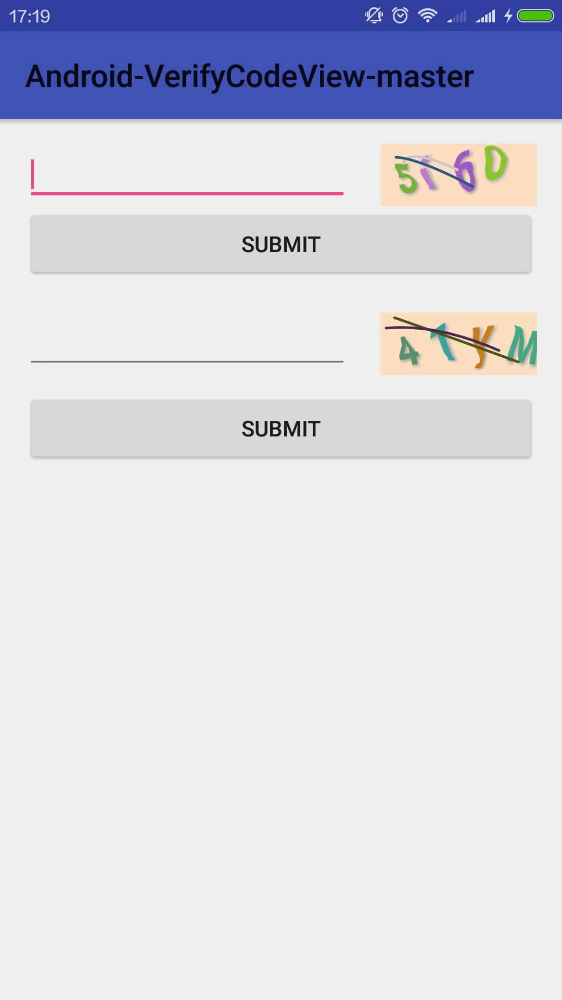
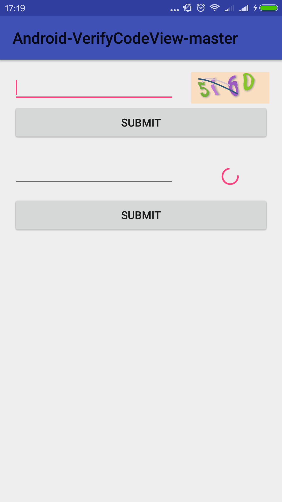

# VerificationCodeView
VerificationCode View


可用于动态生成验证码，常见于金融类app

## App Preview


代码原理以及说明请看这一篇博客：
[Android实现动态验证码的技术调研与实现](http://blog.csdn.net/dreamsever/article/details/53467708)

建议将宽高比设置为5:2，如果不是5:2现在会按照5:2的比例居中显示到控件


usage

```
<sgffsg.com.verifycodeview.VerificationCodeView
    android:id="@+id/verifycodeview"
    android:layout_alignParentRight="true"
    android:layout_width="100dp"
    android:layout_height="40dp" />

```

```
verificationCodeView.setOnClickListener(new View.OnClickListener() {
    @Override
    public void onClick(View view) {
        edit_input.setText("");
        verificationCodeView.refreshCode();
    }
});

```

####请求网络验证码时

```
<sgffsg.com.verifycodeview.VerificationCodeView
    android:id="@+id/net_verifycodeview"
    android:layout_width="100dp"
    android:layout_height="40dp"
    android:visibility="gone"
    app:isNetCode="true"/>
```


Thanks

[CaptchaImageView](https://github.com/jineshfrancs/CaptchaImageView)


##License
MIT